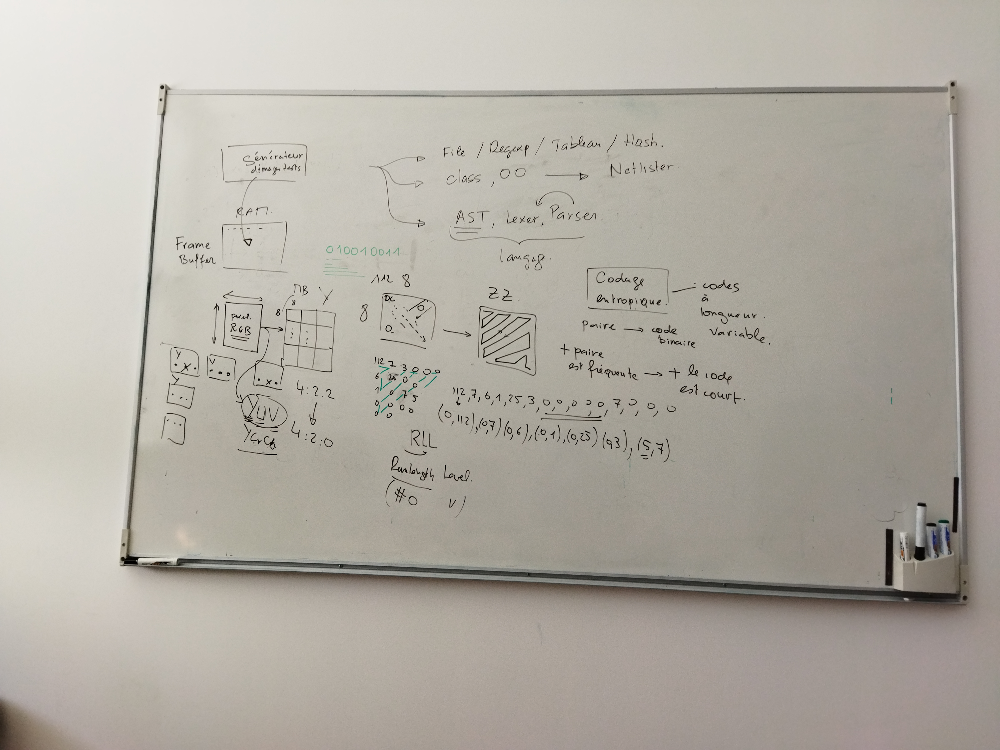

# Conception FPGA d'un compresseur vidéo
Vincent Robin, ENSTA Bretagne, vincent.robin@ensta-bretagne.org

Enseignant responsable : Jean-Christophe Le Lann, jean-christophe.le_lann@ensta-bretagne.fr

## Première partie : génération d'images et d'imagettes de test

1ère étape : génération d'images de test .ppm
Par exemple on écrit un fichier avec nos specifications :
- la forme souhaitée : rectangle, rond, carré, ...
- la couleur : bleu, rouge, vert...
- la position
Le but est d'avoir des images pour lesquelles on maîtrise les caractéristiques.
On veut aussi pour voir générer des imagettes (sur quelques pixels) pour tester l’algorithme de compression et pouvoir éventuellement refaire certains calculs à la main, en connaissant parfaitement notre image d'origine décrite sur quelques pixels. 

## Deuxième partie : algorithme de compression de l'information

**1)** Notre générateur d'image va produire une image RGB que l'on stockera dans une RAM : la "frame buffer". On passe dans l'espace RGB vers YUV (YCrCb), puis au format 4:2:2. Ce sous échantillonnage est déjà une forme de compression en soit. Car pour 4 pixels on garde deux pixels Y et un pixel Cr et Cb. Cependant ce sous-échantillonnage n'est quasiment pas perceptible à l'œil humain et n'impacte donc que très peu la qualité de l'image. 

**2)** Transformation de l'image en Macroblocks de 8*8 (cette dimension semble la plus judicieuse, cependant on se réserve la possibilité de modifier ces dimensions) -> prévoir en conséquence des variables modifiables à tout moment et rendre notre programme modulable). Il y a donc pour chaque pixels de l'image 3 Macroblocks : 1 pour la luminance et deux autres pour les chrominances Cr et Cb.

**3)** DCT : elle apporte plus d'importance aux composantes présentes sur la diagonale qui part d'en haut à gauche et se termine en bas à droite. Autour de cette diagonale il y a beaucoup de zéros. Les composantes continues sont présentes en haut à gauche sur la diagonale. 

**4)** Quantification : permet de diminuer les coefficients issus de la DCT et même d'approximer les très faibles valeurs à zéro en arrondissant leurs résultats (par exemple un '1' devient un '0')

**5)** Zig-zag : permet de sérialiser les zéros en suivant la diagonale qui contient beaucoup de zéros (celle qui va du bas à gauche au haut à droite)

**6)** RLL (Run Length Level) ou RLE (Run Length Encoding) : compte le nombre de zéros avant un certain chiffre dans le flux. Exemple : le zig-zag nous donne la séquence suivante : 112, 7, 6, 1, 25, 3, 0, 0, 0, 0, 0, 7, 0, 0, 0 qui devient (0, 112), (0, 7), (0, 6), (0, 1), (0, 25), (0, 3), (5, 7). Au début la méthode semble contre-productive en terme de compression car on ajoute de nouveau éléments, mais ensuite, dès qu'il y a une série de zéros on compresse beaucoup l'information.

**7)** Codage entropique avec des codes à longueur variable (Huffman est le plus répandu, mais d'autres existent tels que LZ77). Le principe se base sur le fait que plus la paire (issue de la méthode RLE) est fréquente, plus le code binaire est court. Avec cette méthode on obtient en sortie un flux binaire (1000100001000), où chaque paire a une longueur variable. L'idée ensuite est de générer un binaire avec la suite de bits puis de calculer le taux de compression en fonction de la taille de notre image d'origine en bits. Attention ! On ne peut pas écrire les données en sortie du codec en ASCII dans un fichier texte, car 0 sera écrit comme le caractère ASCII "0" sur 8 bits et non pas sur 1 bit. C'est pourquoi lors du calcul du taux de compression, on a un facteur 8 qui nous permet pas de comparer avec un ordre de grandeur identique la taille du fichier d'origine et la taille du fichier compressé.

## Points d'attention et problèmes à contourner

Au niveau du décodage un problème se pose : comment retrouver les "frontières" d'une paire dans le flux binaire qui est de longueur variable. Une possibilité est d'ajouter en fin de trame pour chaque Macroblock un marqueur de fin qui ait une séquence qui ne se reproduise pas dans la trame du Macroblock. Pour la petite histoire, lorsque que l'on avance ou recule dans un film avec la télécommande, on ne fait que balayer très rapidement les marqueurs de fin de trame contenues dans le film.

Un deuxième problème est le fait de transmettre la table de fréquence du code entropique dans les données compressés. Deux stratégies peuvent êtres adoptées : soit transmettre la table de manière **dynamique** (avec à chaque fois une table différente pour les séquences de la vidéo), soit de manières **statique**. En statique, la compression est meilleurs car on transmet la table des fréquences qu'une seule fois avec les données compressés. Cependant, il faut réaliser une étude statistique pour savoir qu'elles sont les paires (issues de la méthode RLE) qui ressortent le plus pour différentes images/vidéos. Un point de vigilance à garder à l'esprit est que l'on va faire dans tout les cas une approximation sur notre table des fréquences en faisant une moyenne des fréquences des paires observées. C'est pourquoi, on ferait mieux de se baser sur un grand nombre d'échantillons pour ne pas fausser notre calcul de moyenne. En effet, la moyenne de quelques échantillons n'est pas représentative de la réalité. 

La compression permet d'économiser énormément d'énergie et de stockage dans les serveurs informatiques. Cependant, si l’algorithme de compression est trop complexe on est contre-productif puisque la puissance de calcul est plus importante, ce qui rend le système énergivore. On a donc un compromis à faire entre le taux de compression et la complexité algorithmique de la compression. De ce point de vue là, nous sommes aussi limités au niveau matériel par les performances de la carte FPGA sur laquelle nous allons implémenter notre compresseur vidéo. Cependant, on ne se préoccupera pas ici de la complexité algorithmique, car on dispose à l'école de cartes FPGA suffisamment puissante. 

## Les prochaines tâches à réaliser

Ce qu'il faut faire : construire un modèle de référence dans le langage de mon choix pour l'encodeur et le décodeur. Jean Christophe pourra ensuite le co-construire en Ruby. Pour le prototypage deux langages informatiques sont particulièrement utiles : Python et Matlab (qui est très proche du langage Python). 

Ensuite, on trouvera une solution pour implémenter ce modèle de référence sur FPGA. On pourra par exemple imaginer qu'une carte FPGA capte une vidéo avec une caméra aura le rôle de compresseur et renverra sur un PC via liaison VGA l'image.
Ou une deuxième solution est qu'un PC joue le rôle de codeur et que la FPGA fasse le décodage puis transmette par liaison VGA l'image décodée.

## Annexe : photo de la réunion

*Figure 1 : Tableau de la réunion du 03/11/2022*